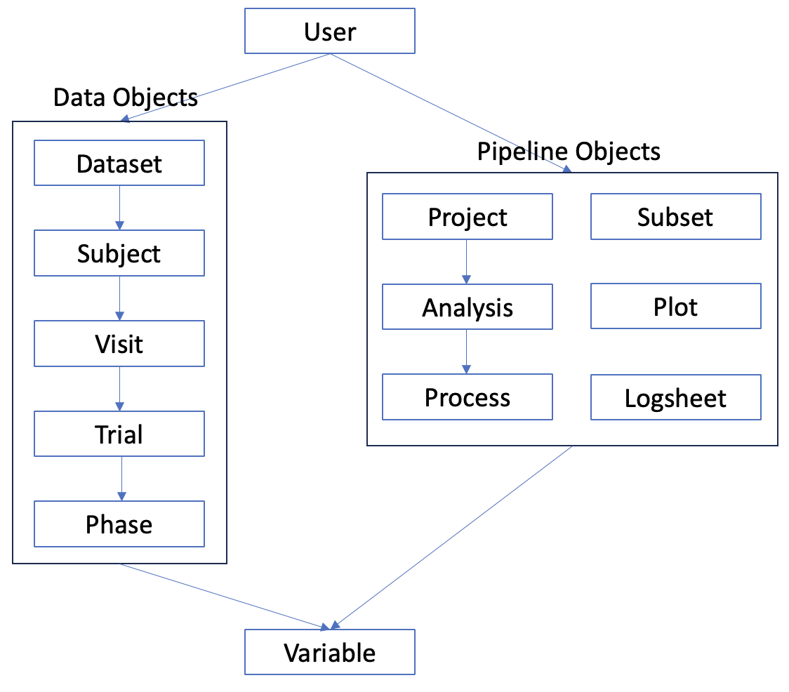

# Research Objects

## Overview
Everything within the ResearchOS framework is a Research Object - at the highest level are User objects, and at the lowest are Variable objects. All Research Objects are stored in the database, and are accessible by using the methods provided in the ResearchOS API.

All Research Objects are one or both of the following:

- **Data Objects** - objects that are involved in storing data, such as a Subject or Trial. These objects are typically created by a Process, and are used to store data that is generated by a Process. It is perhaps helpful to recognize that these objects are similar in nature to the "factors" of a statistical analysis.

- **Pipeline Objects** - objects that are involved in performing data analysis, such as a Process or Project.

::: ResearchOS.research_object.ResearchObject